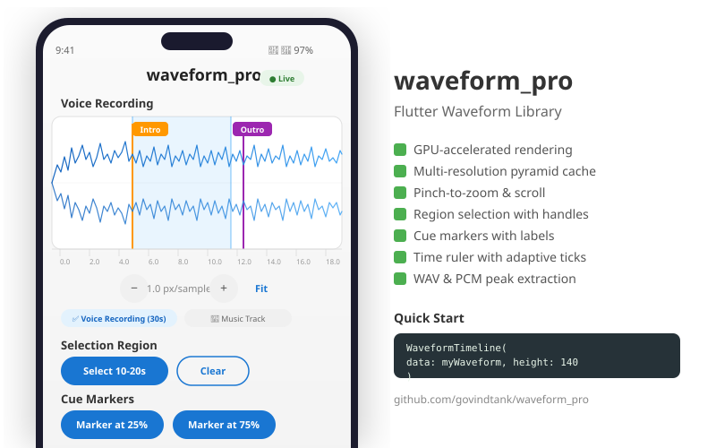

# waveform_pro



A production-quality Flutter waveform widget with GPU-accelerated rendering, zoom, region selection, cue markers, and audio peak extraction.

## Features

- ⚡ **GPU-accelerated rendering** — multi-resolution pyramid cache for efficient drawing at any zoom level
- 🔍 **Pinch-to-zoom & scroll** — zoom into micro-detail or see the full track
- 🎯 **Region selection** — highlight and select portions of the waveform
- 📌 **Cue markers** — annotate the timeline with labeled bookmarks
- 📏 **Time ruler** — adaptive tick marks that respond to zoom level
- 🎨 **Fully customizable styling** — colors, sizes, stroke widths
- 📱 **Touch-optimized** — gestures designed for mobile interaction
- 🔊 **Peak extraction** — utilities for WAV, PCM, and FFmpeg audio sources

## Installation

```yaml
dependencies:
  waveform_pro: ^1.0.0
```

Or use a Git dependency:

```yaml
dependencies:
  waveform_pro:
    git:
      url: https://github.com/govindtank/waveform_pro.git
```

## Quick Start

```dart
import 'package:waveform_pro/waveform_pro.dart';

// Generate synthetic waveform data for demo
final data = WaveformData.generate(
  sampleCount: 3000,
  durationSeconds: 30,
);

// Or extract from real audio:
// final bytes = await File('audio.wav').readAsBytes();
// final data = PeakExtractor.fromWavBytes(bytes);

// Display with full interactive features
WaveformTimeline(
  data: data,
  height: 140,
  style: const WaveformStyle(
    waveColor: Color(0xFF4CAF50),
  ),
  onTap: (time) => print('Tapped at $time s'),
  enableZoom: true,
  enableMarkers: true,
);
```

## Controller Usage

Create a `WaveformController` to programmatically control zoom, scroll, regions, and markers.

```dart
final controller = WaveformController(
  initialPixelsPerSample: 2.0,
  maxPixelsPerSample: 100.0,
  minPixelsPerSample: 0.1,
);

WaveformTimeline(
  data: data,
  controller: controller,
  height: 140,
);

// Later — zoom, scroll, and reset programmatically
controller.zoomIn();          // 1.5x zoom in (default factor)
controller.zoomOut(2.0);      // 2x zoom out
controller.resetZoom();       // fit all in viewport
controller.scrollToTime(15);  // jump to 15-second mark

// Listen for state changes
controller.onZoomChanged = (pps) => print('Zoom: $pps px/sample');
controller.onScrollChanged = (offset) => print('Scrolled to $offset px');

// Query current state
final (startTime, endTime) = controller.visibleTimeRange;
print('Visible: ${startTime}s – ${endTime}s');
```

## Regions & Markers

Programmatically add and manage highlighted regions and cue markers.

```dart
final controller = WaveformController();

// Highlight a region from 20% to 50% of the track
controller.addRegion(WaveformRegion(
  startFraction: 0.2,
  endFraction: 0.5,
  color: Color(0x402196F3),
  label: 'Chorus',
));

// Place a cue marker at 75%
controller.addMarker(CueMarker(
  positionFraction: 0.75,
  label: 'Outro',
  color: Colors.red,
));

// Read them back
for (final r in controller.regions) {
  print('Region: ${r.startFraction} – ${r.endFraction}');
}
for (final m in controller.markers) {
  print('Marker: ${m.label} at ${m.positionFraction}');
}

// Clear
controller.clearRegions();
controller.clearMarkers();

WaveformTimeline(
  data: data,
  controller: controller,
  enableRegionSelection: true,
  enableMarkers: true,
  onRegionChanged: (start, end) {
    print('Region selected: ${start}s – ${end}s');
  },
);
```

## Peak Extraction

Extract waveform data from real audio files.

```dart
import 'dart:io';
import 'package:waveform_pro/waveform_pro.dart';

// From WAV file bytes
final bytes = await File('recording.wav').readAsBytes();
final wavData = PeakExtractor.fromWavBytes(bytes);

// From raw PCM float samples (e.g. from FFmpeg pipe)
final rawSamples = <double>[/* ... -1.0 to 1.0 ... */];
final pcmData = PeakExtractor.fromPcmFloats(
  rawSamples,
  sampleRate: 44100,
  targetSamples: 2000,
);

// Use the extracted data
WaveformTimeline(
  data: wavData,
  height: 140,
);
```

## Full Example

```dart
import 'package:flutter/material.dart';
import 'package:waveform_pro/waveform_pro.dart';

void main() => runApp(const MyApp());

class MyApp extends StatelessWidget {
  const MyApp({super.key});

  @override
  Widget build(BuildContext context) {
    return MaterialApp(
      home: Scaffold(
        appBar: AppBar(title: const Text('Waveform Pro')),
        body: Padding(
          padding: const EdgeInsets.all(16),
          child: WaveformTimeline(
            data: WaveformData.generate(),
            controller: WaveformController(),
            enableZoom: true,
            enableMarkers: true,
          ),
        ),
      ),
    );
  }
}
```

## API Reference

### `WaveformData`

Holds peak samples with a multi-resolution pyramid cache for efficient rendering at any zoom level.

| Constructor / Factory | Description |
|---|---|
| `WaveformData({required List<double> samples, required double durationSeconds})` | Create from normalized peak samples (0.0–1.0). |
| `WaveformData.generate({int sampleCount, double durationSeconds, double noiseLevel})` | Synthetic data for demos and testing. |

| Property | Type | Description |
|---|---|---|
| `samples` | `List<double>` | Raw peak samples (normalized 0.0–1.0). |
| `durationSeconds` | `double` | Total audio duration. |
| `sampleCount` | `int` | Number of samples. |
| `secondsPerSample` | `double` | Duration per sample bin. |
| `samplesPerSecond` | `double` | Sample rate of the data. |

| Method | Returns | Description |
|---|---|---|
| `getLevel(int visibleSamples)` | `List<double>` | Get the pyramid level matching viewport resolution. |

### `WaveformTimeline`

The main interactive waveform widget.

| Parameter | Type | Default | Description |
|---|---|---|---|
| `data` | `WaveformData` | **required** | Waveform peak data to display. |
| `controller` | `WaveformController?` | auto | External control over zoom, scroll, regions, markers. |
| `style` | `WaveformStyle` | defaults | Colors, stroke widths, spacing. |
| `height` | `double` | `120` | Widget height in pixels. |
| `showTimeRuler` | `bool` | `true` | Show time tick ruler below waveform. |
| `enableZoom` | `bool` | `true` | Allow pinch-to-zoom. |
| `enableRegionSelection` | `bool` | `true` | Allow region selection. |
| `enableMarkers` | `bool` | `true` | Allow long-press to add markers. |
| `playheadPosition` | `double` | `-1` | Current playhead position in seconds (`-1` = hidden). |
| `playheadColor` | `Color` | `Colors.red` | Playhead line color. |
| `onTap` | `void Function(double)?` | — | Tap callback with time in seconds. |
| `onRegionChanged` | `void Function(double, double)?` | — | Region selection callback (start, end seconds). |
| `onPlayheadChanged` | `void Function(double)?` | — | Playhead drag callback with time in seconds. |

### `WaveformController`

Manages zoom, scroll, region selections, and cue markers programmatically.

| Constructor Parameter | Type | Default | Description |
|---|---|---|---|
| `initialPixelsPerSample` | `double` | `1.0` | Starting zoom level. |
| `maxPixelsPerSample` | `double` | `100.0` | Zoom-in limit. |
| `minPixelsPerSample` | `double` | `0.1` | Zoom-out limit. |
| `scrollOffset` | `double` | `0.0` | Initial scroll position in pixels. |
| `regions` | `List<WaveformRegion>?` | `[]` | Initial regions. |
| `markers` | `List<CueMarker>?` | `[]` | Initial markers. |

| Method | Description |
|---|---|
| `zoomIn([double factor])` | Zoom in by factor (default 1.5×). |
| `zoomOut([double factor])` | Zoom out by factor. |
| `resetZoom()` | Fit all samples in viewport. |
| `scrollToTime(double seconds)` | Scroll to make time position visible. |
| `scrollToSample(int index)` | Scroll to make sample index visible. |
| `addRegion(WaveformRegion)` | Add a highlighted region. |
| `removeRegion(WaveformRegion)` | Remove a region. |
| `clearRegions()` | Remove all regions. |
| `addMarker(CueMarker)` | Add a cue marker. |
| `removeMarker(CueMarker)` | Remove a marker. |
| `clearMarkers()` | Remove all markers. |
| `pixelToTime(double pixelX)` | Convert pixel X to audio time in seconds. |
| `timeToPixel(double seconds)` | Convert audio time to pixel X position. |

| Property | Type | Description |
|---|---|---|
| `pixelsPerSample` | `double` | Current zoom level. |
| `scrollOffset` | `double` | Current scroll offset in pixels. |
| `visibleSampleRange` | `(int, int)` | Visible sample range `[start, end]`. |
| `visibleTimeRange` | `(double, double)` | Visible time range in seconds. |
| `regions` | `List<WaveformRegion>` | Active regions. |
| `markers` | `List<CueMarker>` | Active markers. |
| `onZoomChanged` | `void Function(double)?` | Zoom change callback. |
| `onScrollChanged` | `void Function(double)?` | Scroll change callback. |

### `WaveformStyle`

Visual styling for the waveform.

| Parameter | Type | Default | Description |
|---|---|---|---|
| `waveColor` | `Color` | `Color(0xFF2196F3)` | Waveform fill/stroke color. |
| `backgroundColor` | `Color` | `Color(0xFFF5F5F5)` | Widget background. |
| `regionColor` | `Color` | `Color(0x302196F3)` | Region highlight fill. |
| `centerLineColor` | `Color` | `Color(0x1A000000)` | Horizontal center line. |
| `waveStrokeWidth` | `double` | `1.0` | Waveform line thickness. |
| `topPadding` | `double` | `2.0` | Top padding inside the widget. |

### `WaveformRegion`

A selected portion of the waveform.

| Parameter | Type | Default | Description |
|---|---|---|---|
| `startFraction` | `double` | **required** | Start as fraction of total duration (0.0–1.0). |
| `endFraction` | `double` | **required** | End as fraction of total duration. |
| `color` | `Color` | `Color(0x302196F3)` | Highlight color. |
| `label` | `String` | `''` | Optional label. |

| Method | Returns | Description |
|---|---|---|
| `startSeconds(double total)` | `double` | Start position in seconds. |
| `endSeconds(double total)` | `double` | End position in seconds. |
| `durationSeconds(double total)` | `double` | Region duration in seconds. |
| `contains(double fraction)` | `bool` | Whether fraction is inside region. |
| `copyWith(...)` | `WaveformRegion` | Create a copy with modified fields. |

### `CueMarker`

A labeled bookmark on the waveform timeline.

| Parameter | Type | Default | Description |
|---|---|---|---|
| `positionFraction` | `double` | **required** | Position as fraction of total duration (0.0–1.0). |
| `label` | `String` | `''` | Label text. |
| `color` | `Color` | `Colors.red` | Marker color. |
| `icon` | `IconData?` | `null` | Optional icon for the marker. |

| Method | Returns | Description |
|---|---|---|
| `positionSeconds(double total)` | `double` | Position in seconds. |
| `copyWith(...)` | `CueMarker` | Create a copy with modified fields. |

### `PeakExtractor`

Static utility methods for extracting waveform data from audio sources.

| Method | Returns | Description |
|---|---|---|
| `fromWavBytes(Uint8List, {int targetSamples})` | `WaveformData` | Extract peaks from 16-bit/8-bit WAV bytes. |
| `fromPcmFloats(List<double>, {int sampleRate, int targetSamples})` | `WaveformData` | Extract peaks from raw PCM float samples. |

## Audio Source Notes

For production use, extract peaks on a server or via FFmpeg:

- **Mobile:** Use `ffmpeg_kit_flutter` to extract raw PCM → `PeakExtractor.fromPcmFloats()`
- **Desktop:** Use `dart:io` Process + FFmpeg `-f f32le` output
- **Server:** Any audio processing library → export as JSON peak array

## Testing

```bash
flutter test
```

## License

Apache 2.0
